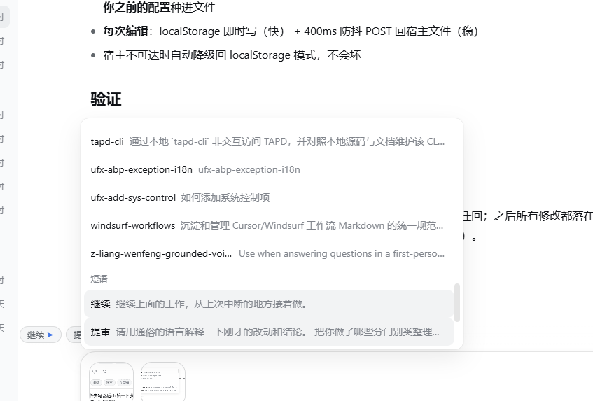

# dsh-quick-phrases

DeepSeek Harness（DSH）客户端插件：**输入框上方的快捷短语条 + `/` 触发短语菜单**。

> 🔧 **这是一个"封存状态"的仓库**：功能基本可用，但遗留 2 个已知瑕疵（见下文 [已知瑕疵](#-已知瑕疵求助)），作者折腾几轮未能彻底解决，现开源抛给社区，欢迎 PR / issue / 鞭策。
>
> 🇬🇧 TL;DR — A DeepSeek Harness client plugin that adds a quick-phrase chip bar above the composer and a `/`-triggered phrase menu. Works end-to-end; 2 known UI flaws documented below with screenshots. Help wanted.

---

## ✅ 已实现（真实环境验证过）

| 功能 | 说明 |
|---|---|
| 快捷短语条 | 常驻输入框上方（官方 `conversation.input.dock` slot），点击 chip 把短语填入输入框 |
| ➤ 点击即发送 | 每条短语可独立开启；点击后**延迟验证草稿确实写入**再提交（防抢跑发出空/旧草稿），chip 上带 ➤ 标记 |
| `/` 短语菜单 | 输入 `/` 出现「短语」分组，★置顶排最前，按名称/内容模糊过滤 |
| `/名称` + 回车 | 草稿为 `/短语名` 时，提交自动展开为短语内容（matchEnter 纯文本路径） |
| 管理面板 | chip 条末尾「⚙ 管理」：增删改 / ★置顶 / ➤自动发送 / ↑↓排序 / 显示开关 / JSON 导入导出 / 恢复默认 |
| 宿主文件持久化 | 短语表存 `$DSH_HOME/storages/dsh-quick-phrases/phrases.json`，原子写入（tmp+rename），跨重启、跨浏览器可靠；首次运行自动从旧 localStorage 键迁移；宿主不可达时回退 localStorage |
| 安全边界 | 纯客户端数据，不进会话日志、不影响模型上下文；宿主路由带同源 fence（loopback + Origin/Sec-Fetch-Site 校验） |

持久化已在真实环境验证：重启 DSH 后自定义短语（含改名）完整存活。

## 🐞 已知瑕疵（求助 🙏）

> 以下问题**如实封存**，作者已尽力但未解决。截图均来自真实运行环境（DSH `0.1.1-rc.2`，Windows，Chrome，Web GUI @ `127.0.0.1:3080`）。

### 瑕疵 1：chips 行与输入卡左边缘不对齐


- **现象**：chips 行明显比输入卡更靠左（延伸到窗口边缘附近），没有和卡片对齐。
- **量化**（对上图 OCR + 像素扫描实测，窗口宽度约 960px 估测）：
  - chips 行左缘 ≈ `x=16px`
  - 输入卡内文本起点 `x=108px`（OCR 实测），推算卡片左缘 ≈ `x=90px`
  - **水平偏差 ≈ 75px**，即 chips 行看起来比 780px 的卡片更宽
- **已尝试的方案**：
  1. **照抄官方 GoalBar 的对齐公式**（`ui-goal` 的 `.dock` 类）：
     `width: calc(100% - 2×var(--dsh-composer-side-clearance) - 4×var(--dsh-composer-dock-inset)); margin: 0 auto`
     → 结果更糟：chips 行按**视口宽**计算后向左溢出，第一个 chip 被窗口边缘裁掉。
  2. **`width: 100%`**（依据：dock 条目与输入卡同为 `composerStack`（`.pXSMma_stack { max-width: 780px; align-items: stretch }`）的直接子节点，理论应严格同宽）
     → 仍然偏左，见截图。
- **疑点**：`conversation.input.dock` 条目在真实 DOM 里的**包含块似乎并不是 `composerStack`**——否则 `width:100%` 不可能比 780px 宽。可能存在中间包装层或 portal。**求助：有条件的话请开 DevTools 看一下 `.qp-bar` 元素的实际 offsetParent / computed width，一条信息可能就破案。**

### 瑕疵 2：`/` 菜单里「短语」分组默认不可见

按 `/` 后的默认视图（只有命令和技能，看不到短语）：


按方向键向下滚动之后，才能在菜单**最底部**看到「短语」分组：



- **已知原因**：菜单分组按 `InputTriggerSource.order` 升序排列（越小越靠前）。内置命令/技能源在前（如 `ui-skill` 注册 `order: 2`），本插件注册的是 `order: 3` → 沉底。
- **为什么没修**：按"封存当前状态"原则未改动，留给社区决定交互取向。
- **候选方案**（供参考）：
  - 把 `order` 改为 `-1`，短语组置顶（最简单，一行改动）；
  - 或保持排序、但让菜单默认滚动到/展开用户最常用的分组；
  - 或给分组加"记忆上次选择"。
- **顺带一提**：即使不滚到短语组，直接输入 `/名称` + 回车仍可展开短语（matchEnter 路径），功能不受影响，只是菜单可见性问题。

## 安装（本机 profile，离线方式）

```powershell
# 1. 拷贝包到 profile 的 node_modules
Copy-Item -Recurse <本包目录> "$env:DSH_HOME\profiles\web\node_modules\dsh-quick-phrases"

# 2. 在 "$env:DSH_HOME\profiles\web\package.json" 里注册两处：
#    dependencies 加 "dsh-quick-phrases": "^0.1.0"
#    dsh.profile.bundles 加 "dsh-quick-phrases"

# 3. 重启 DSH web（新插件需要宿主重启才会被发现）
```

有网络/registry 时也可用官方命令一步完成：`dsh plugin --profile web add <本包路径>`。

## 使用

| 操作 | 效果 |
|---|---|
| 点击 chip | 短语内容追加到输入框（空草稿直接填入，否则以空格衔接）；开了 ➤ 的短语验证写入后自动发送 |
| 输入 `/` | 菜单出现「短语」分组（⚠ 见瑕疵2：目前沉底，需方向键滚到底）；继续输入可按名称/内容过滤 |
| `/继续` + 回车 | 草稿为该短语名时，提交自动展开为短语内容 |
| 点击「⚙ 管理」 | 打开管理面板（★置顶 / ➤自动发送 / ↑↓排序 / 删除 / JSON 导入导出 / 恢复默认） |

## 卸载

从 profile 的 `package.json` 删除 `dsh-quick-phrases`（dependencies 与 bundles 两处），
删除 `node_modules\dsh-quick-phrases` 目录，重启 DSH。短语数据在
`$DSH_HOME/storages/dsh-quick-phrases/phrases.json`，按需删除。

## 工作原理

```
lib/index.js   宿主入口：GET/POST /plugins/dsh-quick-phrases/phrases 路由（同源 fence + 原子写盘）
lib/client.js  客户端 bundle（window.__ModuleLoader__ 格式，手写无需构建）：
               ├─ InputTriggerSource（trigger '/', onPick 纯文本路径 + matchEnter 展开发送）
               ├─ conversation.input.dock slot（chips 条 + 管理面板，React 18 + useSyncExternalStore）
               └─ 持久化：宿主文件为准，localStorage 缓存/回退，旧键自动迁移
```

## 开发

无需构建链——`lib/client.js` 是手写的最终产物（格式对齐官方 `tsdown` 产物），改完直接拷贝部署。

```powershell
node scripts/verify.mjs   # 语法 + 包结构检查
node scripts/smoke.mjs    # 无头逻辑冒烟测试（store / 触发源 / 持久化迁移，10 项断言）
```

改动后同步到 profile：

```powershell
Copy-Item -Recurse -Force -Path ".\*" -Destination "$env:DSH_HOME\profiles\web\node_modules\dsh-quick-phrases\"
# 然后重启 DSH
```

## License

MIT
