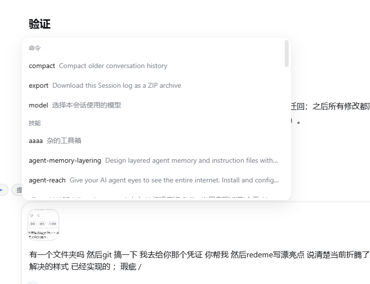

# dsh-quick-phrases

DeepSeek Harness（DSH）客户端插件：**输入框上方的快捷短语条 + `/` 触发短语菜单**。

> 🇬🇧 TL;DR — A DeepSeek Harness client plugin that adds a quick-phrase chip bar above the composer and a `/`-triggered phrase menu (phrases group pinned to the top). Pure client-side, host-file persistence, no build step.

当前版本 **v0.2.0**。v0.1.0 曾带着 2 个 UI 瑕疵以"封存状态"开源求助，v0.2.0 两个都已修复（见 [修复记录](#-修复记录v020)）。另有一个**多窗口并发写**的架构缺陷尚未修复（真实踩过坑），见 [已知缺陷](#️-已知缺陷求助-)。

---

## ✅ 功能（真实环境验证过）

| 功能 | 说明 |
|---|---|
| 快捷短语条 | 常驻输入框上方（官方 `conversation.input.dock` slot），与输入卡**逐像素对齐**（运行时实测镜像），点击 chip 把短语填入输入框 |
| ➤ 点击即发送 | 每条短语可独立开启；点击后**延迟验证草稿确实写入**再提交（防抢跑发出空/旧草稿），chip 上带 ➤ 标记 |
| `/` 短语菜单 | 输入 `/` 出现「短语」分组，**置顶于命令/技能等全部内置组**（`order: -1`），★置顶排最前，按名称/内容模糊过滤 |
| `/名称` + 回车 | 草稿为 `/短语名` 时，提交自动展开为短语内容（matchEnter 纯文本路径） |
| 管理面板 | chip 条末尾「⚙ 管理」：增删改 / ★置顶 / ➤自动发送 / ↑↓排序 / 显示开关 / JSON 导入导出 / 恢复默认 |
| 宿主文件持久化 | 短语表存 `$DSH_HOME/storages/dsh-quick-phrases/phrases.json`，原子写入（tmp+rename），跨重启、跨浏览器可靠；首次运行自动从旧 localStorage 键迁移；宿主不可达时回退 localStorage |
| 安全边界 | 纯客户端数据，不进会话日志、不影响模型上下文；宿主路由带同源 fence（loopback + Origin/Sec-Fetch-Site 校验） |

## 🛠 修复记录（v0.2.0）

v0.1.0 封存时遗留的两个瑕疵，修复思路与过程如下（截图为**修复前**实况，留作档案）。

### 瑕疵 1：chips 行与输入卡左边缘不对齐 —— 已修复 ✅

修复前实况（chips 行比输入卡更靠左，水平偏差 ≈ 75px）：


- **失败过的静态方案**（v0.1.0 时期，供后人避坑）：
  1. 照抄官方 GoalBar 对齐公式 `calc(100% - 2×side-clearance - 4×dock-inset)` → 按视口宽计算，向左溢出；
  2. `width: 100%` → 仍偏，说明 dock 槽的包含块与输入卡**不同源**（存在中间包装层）。
- **v0.2.0 修复思路：不再猜结构，运行时实测镜像**。挂载后从快捷条向上爬祖先，找到第一个同时包含 composer `textarea` 的公共容器；再从 textarea 上溯到该容器顶层子节点（即输入卡本体），`getBoundingClientRect()` 实测其 left/width，把快捷条的 `margin-left`/`width` 掰成完全一致。DOM 结构再怎么包，量出来的总是真实几何。
- **保鲜机制**：挂载后 0/120/500ms 三次校准（等布局沉淀）+ `ResizeObserver` 盯住容器与 textarea 尺寸 + `window resize` 兜底——字体加载、侧栏开合、窗口缩放都不会再错位。

### 瑕疵 2：`/` 菜单里「短语」分组沉底 —— 已修复 ✅

修复前实况（默认视图看不到短语组，方向键滚到底才出现）：



- **根因**：菜单分组按 `InputTriggerSource.order` 升序排列，内置技能源 `order: 2`，本插件原注册 `order: 3` → 沉底。
- **修复**：采用当初候选方案的第一条，`order: 3 → -1`，短语组置顶于全部内置组（命令/技能）。短语是本插件的核心入口，理应最先被看到。

## ⚠️ 已知缺陷（求助 🙏）

### 多窗口同时打开时，新短语可能被旧窗口"回滚"

- **现象**（真实踩坑，2026-08-26）：在窗口 A 添加了一条短语，发完消息后这条短语从列表里消失了；而单窗口场景从不复现。
- **根因**：每个 DSH web 页面实例都持有**独立的内存状态副本**，而持久化是"整表覆盖、最后写入者胜"，没有任何冲突检测：
  1. 任一实例 `store.replace()`（增删改、置顶、恢复默认……都会触发）都会把自己的**全量短语表** POST 到宿主文件并同步写 localStorage；
  2. 在添加短语**之前**加载的旧窗口，内存里仍是老表——它一旦发生任意一次状态写入，就会把宿主文件连同 localStorage 一起覆盖回旧表，新短语即被无声回滚；
  3. 另有一条竞态支线：`hydrateFromHost` 是异步的且无条件以宿主文件为准，若 GET 在途期间用户恰好完成了添加（防抖 POST 还没发出），响应回来同样会把新数据冲掉。
- **复现**：开两个 DSH web 窗口 → 窗口 A 添加短语 → 让窗口 B 发生任意一次状态写入（或 A 在 B 首次 hydrate 完成前快速添加）→ A 的新短语消失。
- **临时规避**：编辑短语时只保留一个窗口；编辑完成后刷新其他窗口即可同步到最新表。
- **候选修复方向**（欢迎 PR，按性价比排序）：
  1. `hydrateFromHost` 非破坏化：GET 发出时快照本地状态引用，响应回来时发现本地已变化则跳过覆盖、改为把本地推回宿主；
  2. `persistToHost` 校验 `response.ok`——当前只 catch 网络异常，4xx/5xx 会被静默当成成功；
  3. 整表覆盖改按 id 并集合并，或 payload 增加 `updatedAt` 由宿主做时间戳仲裁；
  4. 跨实例收敛：监听 `storage` 事件或引入 `BroadcastChannel`，让所有窗口实时跟随最新表。

## 安装（本机 profile，离线方式）

```powershell
# 1. 拷贝包到 profile 的 node_modules
Copy-Item -Recurse <本包目录> "$env:DSH_HOME\profiles\web\node_modules\dsh-quick-phrases"

# 2. 在 "$env:DSH_HOME\profiles\web\package.json" 里注册两处：
#    dependencies 加 "dsh-quick-phrases": "^0.2.0"
#    dsh.profile.bundles 加 "dsh-quick-phrases"

# 3. 重启 DSH web（新插件需要宿主重启才会被发现）
```

有网络/registry 时也可用官方命令一步完成：`dsh plugin --profile web add <本包路径>`。

## 使用

| 操作 | 效果 |
|---|---|
| 点击 chip | 短语内容追加到输入框（空草稿直接填入，否则以空格衔接）；开了 ➤ 的短语验证写入后自动发送 |
| 输入 `/` | 菜单**最顶部**出现「短语」分组；继续输入可按名称/内容过滤 |
| `/继续` + 回车 | 草稿为该短语名时，提交自动展开为短语内容 |
| 点击「⚙ 管理」 | 打开管理面板（★置顶 / ➤自动发送 / ↑↓排序 / 删除 / JSON 导入导出 / 恢复默认） |

## 卸载

从 profile 的 `package.json` 删除 `dsh-quick-phrases`（dependencies 与 bundles 两处），
删除 `node_modules\dsh-quick-phrases` 目录，重启 DSH。短语数据在
`$DSH_HOME/storages/dsh-quick-phrases/phrases.json`，按需删除。

## 工作原理

```
lib/index.js   宿主入口：GET/POST /plugins/dsh-quick-phrases/phrases 路由（同源 fence + 原子写盘）
lib/client.js  客户端 bundle（window.__ModuleLoader__ 格式，手写无需构建）：
               ├─ InputTriggerSource（trigger '/', order -1 置顶；onPick 纯文本路径 + matchEnter 展开发送）
               ├─ conversation.input.dock slot（chips 条 + 管理面板，React 18 + useSyncExternalStore）
               │   └─ 对齐：运行时镜像输入卡几何（alignBar + ResizeObserver 保鲜）
               └─ 持久化：宿主文件为准，localStorage 缓存/回退，旧键自动迁移
```

## 开发

无需构建链——`lib/client.js` 是手写的最终产物（格式对齐官方 `tsdown` 产物），改完直接拷贝部署。

```powershell
node scripts/verify.mjs   # 语法 + 包结构检查
node scripts/smoke.mjs    # 无头逻辑冒烟测试（store / 触发源 / 持久化迁移，10 项断言）
```

改动后同步到 profile：

```powershell
Copy-Item -Recurse -Force -Path ".\*" -Destination "$env:DSH_HOME\profiles\web\node_modules\dsh-quick-phrases\"
# 然后重启 DSH
```

## 维护者推送

GitHub token 落盘在 **仓库外** 的 `%USERPROFILE%\.github-token`（全局 gitignore 兜底，永远不会被误提交）。
推送时脚本按需注入认证，不写 `.git/config`：

```powershell
powershell -File scripts\push.ps1          # 推当前分支到 origin/master
powershell -File scripts\push.ps1 -Branch master
```

换 token：直接改 `%USERPROFILE%\.github-token` 那一行即可。

## License

MIT
